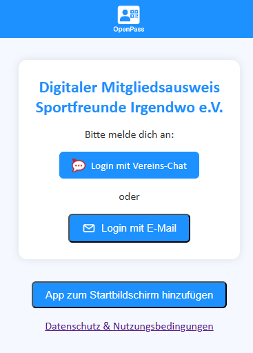
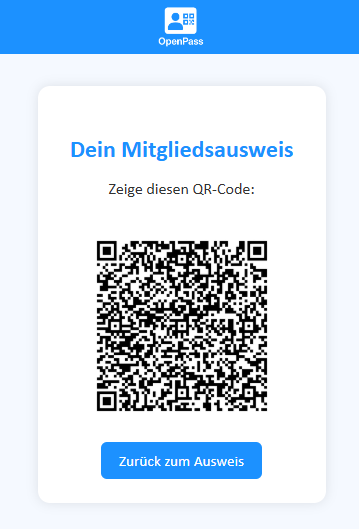
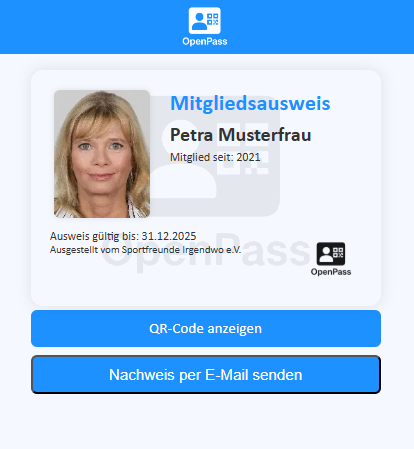

## Inhaltsverzeichnis

## Inhaltsverzeichnis

- [OpenPass - Digitaler Mitgliedsausweis für Vereine](#openpass---digitaler-mitgliedsausweis-fur-vereine)
  - [Features](#features)
  - [Sicherheit](#sicherheit)
  - [Screenshots](#screenshots)
  - [Voraussetzungen](#voraussetzungen)
  - [Haftungsausschluss & Support](#haftungsausschluss--support)
  - [Mitwirken](#mitwirken)
  - [Lizenz](#lizenz)
  - [Weitere Informationen](#weitere-informationen)
  - [Kontakt](#kontakt)

# OpenPass - Digitaler Mitgliedsausweis für Vereine

**Hinweis:** 
Dieses Projekt wurde ursprünglich für den Radtreff Campus Bonn e.V. entwickelt. Es soll nun auch anderen 
Vereinen zur freien Nutzung für den Eigenbedarf zur Verfügung stehen. 

## Features

- Digitaler Mitgliedsausweis
- Login per Email mit Klicklink oder OAuth-Integration mit Rocket.Chat / Authentik
- QR-Code kann zur Autorisierung von
- Varianten mit oder ohne Foto
- Foto wird vom Anwender selbst hochgeladen
- Versand von Mitgliedsbestätigungen per Mail
- Optimiert für die Darstellung auf Smartphones
- Automatische Installation auf dem Startbildschirm (Power WebApp)
- Admin-Interface für Upload von Mitgliederlisten per CSV

## Sicherheit

- Alle(!) Daten werden verschlüsselt gespeichert
- Fotos werden AES-verschlüsselt, Namen der Dateien sind ebenfalls kodiert.
- Token-basierte Authentifizierung
- CSRF-Schutz implementiert
- Entspricht Content Security Policy 
- Rate Limiting für kritische Endpunkte, z.B. Anmeldungsversuche

## Screenshots

## Haftungsausschluss & Support

Diese Software wird **ohne Garantie und ohne Support** bereitgestellt. Sie ist in erster Linie für
Vereine gedacht, in denen die benötigte Expertise (i.W. Python, HTML und ggf. Docker) verfügbar sind. 
Bei Fragen könnt ihr euch gerne per Mail melden. 
**Ich kann allerdings leider keine individuellen Anpassungen oder Fehleranalysen auf Zuruf leisten!**  

## Mitwirken
Beiträge sind willkommen! Bitte beachtet:
1. Fork des Repositories erstellen
2. Feature Branch anlegen (`git checkout -b feature/AmazingFeature`)
3. Änderungen committen (`git commit -m 'Add some AmazingFeature'`)
4. Branch pushen (`git push origin feature/AmazingFeature`)
5. Pull Request erstellen

## Lizenz

Dieses Projekt steht unter der **PolyForm-NC 1.0.0** Lizenz. 
Das bedeutet:

* Frei für **nicht-kommerzielle** Nutzung (Vereine, Schulen, Privat­projekte).  
* **Kommerzielle** Nutzung oder Hosting nur nach separater Lizenz­vereinbarung.  
* Du darfst den Code ansehen, ändern, weitergeben.

> **Aufruf (freiwillig):**  
> Wenn du den Code erweiterst oder Fehler behebst, teile bitte deine Änderungen
> bitte als Pull-Request oder Fork unter derselben Lizenz.  
> So bleibt OpenPass für alle lebendig.

* Die Details findest du in der Datei LICENSE. 
* Eine deutschsprachige Zusammenfassung findest du hier: https://polyformproject.org/licenses/noncommercial/1.0.0/*

## Weitere Informationen

- [ENTWICKLUNGSUMGEBUNG.md](docs/ENTWICKLUNGSUMGEBUNG.md): Installationsanleitung für Entwickler
- [KONFIGURATION.md](docs/KONFIGURATION.md): Alle Konfigurationsparameter erklärt
- [BRANDING.md](docs/BRANDING.md): Anpassung auf euren Verein (Farben, Namen, Links)
- [DEPLOYMENT.md](docs/DEPLOYMENT.md): Deployment mit Docker, Kamal & Co.
- [TESTING.md](docs/TESTING.md): Teststrategie und Coverage
- [MANUAL.md](docs/MANUAL.md): Benutzerhandbuch
- [ADMIN.md](docs/ADMIN.md): Anleitung für Admins

 
## Kontakt
Radtreff Campus Bonn e.V. - florian@radtreffcampus.de
Projekt Link: https://github.com/Flo-63/RCB-Ausweis.git
